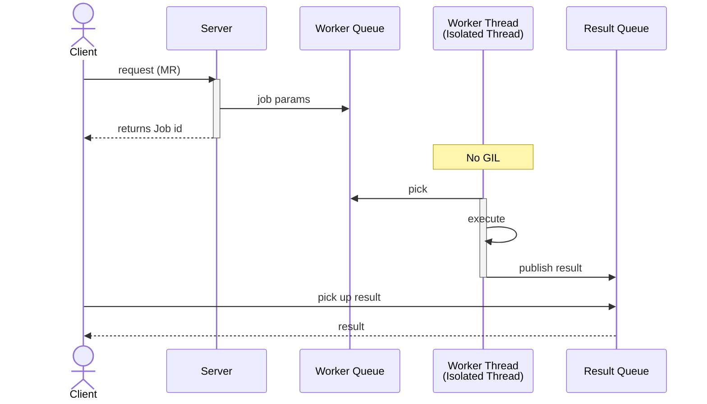

# FThreads

This repo is a playground for testing out Python's new free-threading features in versions 3.13 and 3.14. I wanted to see firsthand how things change now that we’re moving away from the Global Interpreter Lock (GIL).

To put it to the test, I built a MapReduce setup that uses multiple workers for parallel processing. It's pretty cool because modern packages can now actually turn off the GIL, as long as they have extension modules that handle preemptive scheduling safely.

I also got a lot of inspiration from Tiago Rodrigues Antão’s book, Fast Python (2023). He does a deep dive into concurrency using asyncio and multiprocessing in Chapter 3, but since the book came out before these latest Python updates, I decided to do a fresh exploration using the python3.13t build.



## Setup

1. Install `uv` if not already installed in your machine.
2. Setup dev environment using python3.13t.

```bash
uv sync --dev
```

### Tests

- Run the server using the following command:

```bash
export PYTHON_GIL=0
uv run python -t server.py
```

- Run the load test in a different console with the desired parameters:

```bash
# uv run python test_load.py {num_requests} --chunk-size {down_chunk_size} {up_chunk_size}
uv run python test_load.py 3 --chunk-size 1000 2000
```

The *num_requests* indicate the number of client requests to the server.

The *down_chunk_size* and *up_chunk_size* are the bound limits for the corpus length.

## Benchmark: GIL vs No-GIL

A benchmark script is included to compare server performance with the GIL enabled (`PYTHON_GIL=1`) versus disabled (`PYTHON_GIL=0`).

### Running the Benchmark

```bash
# Default: 10 requests, chunk 500-1000 words, 120s timeout
./benchmark.sh

# Custom: 20 requests, chunk 1000-2000 words, 60s timeout
./benchmark.sh 20 1000 2000 60
```

The script starts and stops the server for each run, sends all requests concurrently (using threads in `test_load.py`), and times the full execution under both modes. A timeout (4th argument, default 120s) prevents the GIL run from blocking forever.

### Results

| Mode | Requests | Chunk Size | Workers | Result |
| ---- | -------- | ---------- | ------- | ------ |
| No GIL (`PYTHON_GIL=0`) | 10 | 500-1000 | 4 | Completes normally |
| With GIL (`PYTHON_GIL=1`) | 10 | 500-1000 | 4 | Hangs (deadlock) |

### Findings

- **With the GIL disabled**, 4 worker threads process concurrent MapReduce jobs in true parallel and all requests complete successfully.
- **With the GIL enabled**, the server **deadlocks**. Each worker thread calls `map_reduce()` which internally uses `asyncio.run()` + `asyncio.to_thread()` to parallelize map/reduce phases. Under the GIL, the outer worker threads and the inner `asyncio.to_thread` threads all compete for the same lock, causing thread starvation and effectively a deadlock.
- This demonstrates a real-world scenario where free-threading (PEP 703) enables architectures that are **impossible under the GIL** — not just faster, but the difference between working and not working at all.

## Author

- Mario Reyes Ojeda
